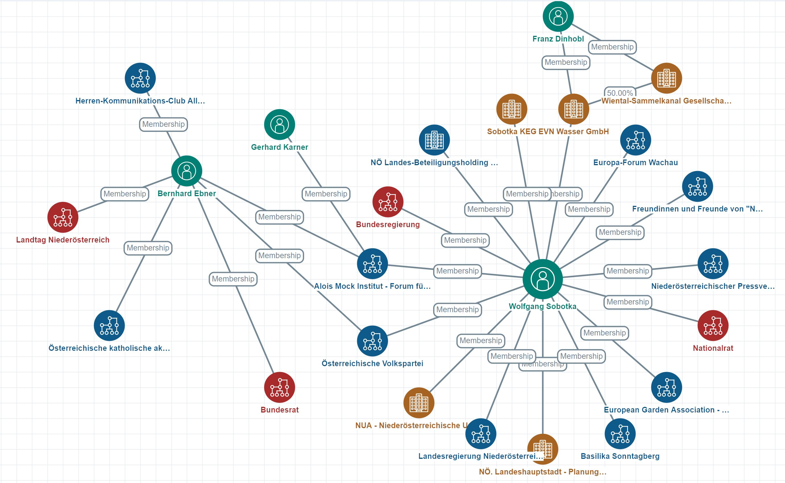
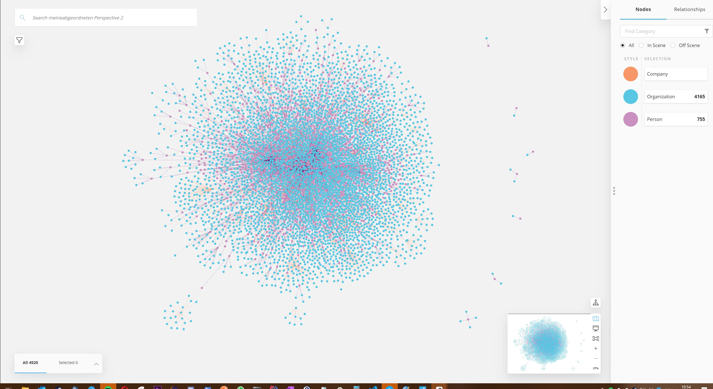
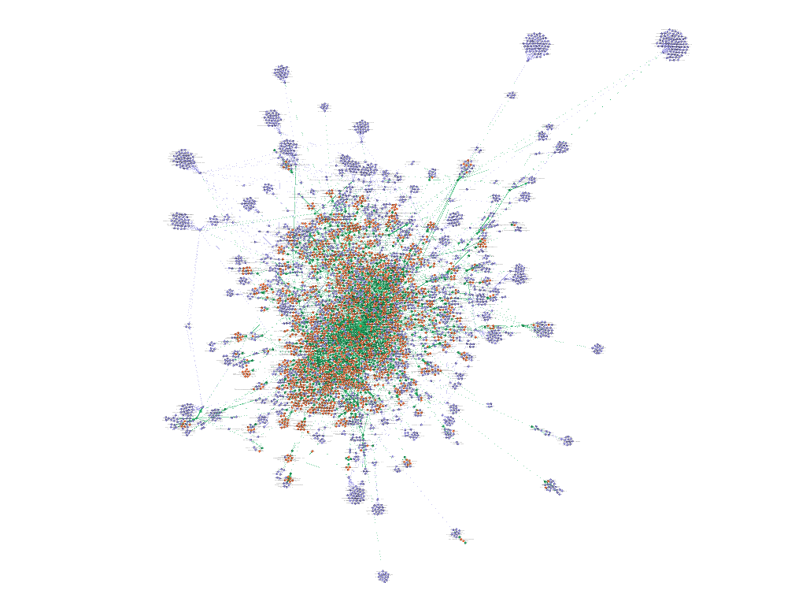

# Austrian politicians, head of departments and members of the "corona commission"

This is a dataset scraped from [meineabgeordneten.at](http://meineabgeordenten.at) (all probs to them). The source format is "Follow the Money" (FtM) by the OCCRP (Organized Crime and Corruption Project). See the following resources:

- https://followthemoney.readthedocs.io/en/latest/index.html
- https://docs.alephdata.org/developers/followthemoney

The graph format can also be exported to RDF, CSV, XLSX, CYPHER (Neo4j) and GEXF (gephi).

With the FtM CLI, you can transform, modify and extend the data. For futher analyzes, this is highly recommended.

## Aleph FtM Graph visualization
If you want to visualize it, use [Aleph](https://aleph.occrp.org), a free and open-source platform for (investigative) journalists.

With Aleph you can also find links to other datasets, leaks and documents that Aleph holds.

## Neo4j
For using neo4j, you can use the neo4h_bulk export or the cypher commands.  

With Linkurious you can also explore the network interactively.

## Gephi
Also Gephi can be used to analyze the network.

# Data acquisition 

The data has been scraped by using opensanctions, a scraping framework used by Aleph. See resources:

- https://github.com/pudo/opensanctions

- https://www.opensanctions.org

- https://docs.alephdata.org/developers/memorious

[Here](https://github.com/PeterWalchhofer/opensanctions) is the scraping script + the forked opensanctions repository to run it on your own.